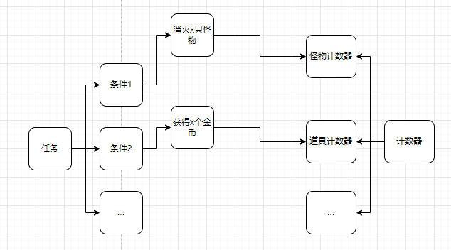
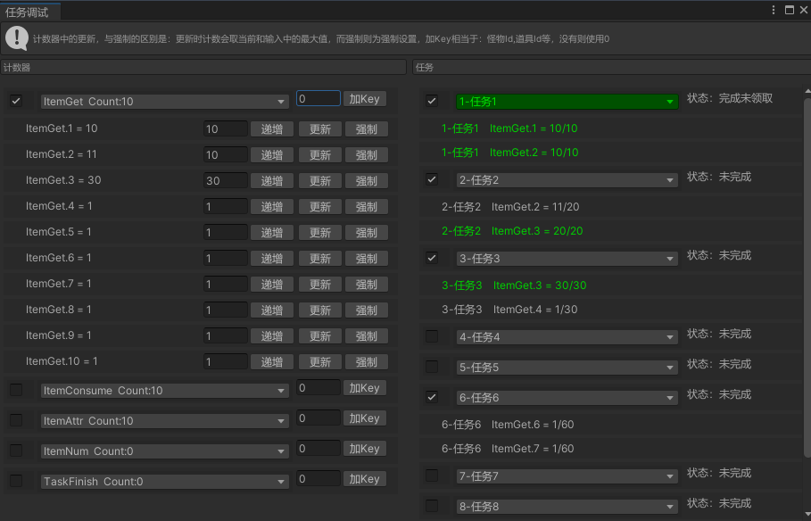

# TaskSystem
通用的游戏任务系统
# 前言
实际参与任务系统后才了解其实底层就是一个计数系统，记录的是游戏中出现的所有计数，包括但不限于：消灭了几只怪物，获得了多少金币/材料，提升了多少级，到达某个城镇/位置等等，有的任务需要从任务开始时才计数，而有的任务的计数是累积的，这样我们能将任务大体上分为两类：累积型，递增型。而消灭了几只怪物，获得了多少金币/材料，提升了多少级，到达某个城镇/位置等等实际任务则是游戏中的一个业务标记。

除了这类累积型，和递增型外还有一种是消耗型，如任务条件是消耗100金币或n个xxx道具，既然是消耗型那么一定消耗的"道具"，一切玩家可获得的东西我将它统称为"道具"，详情可参考背包系统：https://zhuanlan.zhihu.com/p/660125359。消耗的是背包中固有的数量，因此可以检测道具存在数量，强制更新给计数器，那么就可以用累积型的记录方式，每次道具数量变化时强制更新计数，或者是在任务的上层逻辑中单独处理这个问题。

还有是任务种类上的区分：主线，分支，日常，周常等等。当然成就也算一种任务，它的完成条件同样来自这个计数系统，是累积型的任务。同样的游戏中除了任务界面可以看到的任务外，一些控制开关的地方也可以使用任务来控制，比如关卡2-3开启需要达成条件：关卡总得星30个以及角色等级达到10级以及通关关卡2-2等一系列条件，如果不在关卡系统上做又想保持通用性就可以使用一个任务来做为开关，这样这个开关的可扩展性可以涉及游戏全局，而不用根据策划需求变化：同时满足角色阶数到达2阶，角色战力达到1w等特殊需求做修改。



# 计数器
整个任务系统的基本数据来源于计数器，什么时候计数来源于各个业务中，如击杀多少只怪物，那每次击杀怪物时往计数器里加1，其他任何类型同理。
简单的整理计数器结构如下：
```
public enum CounterType
{
    KillMonster,    //击杀怪物数
    GetGold,        //获得金币
    Level,          //等级提升
    //... 扩展：包括游戏中所有需要记录的计数
}
public class CounterData
{
    public CounterType counterType;     //计数类型
    public int accumulate;              //累计值
}
```
但我现在有任务是击杀id=3的怪物10只，击杀id=4的怪物10只，那样我们的CounterType就需要有两个来标识，如果有id=5,id=6呢又要继续添加类型，因此我们再做一下优化：
```
public enum CounterType
{
    KillMonster,    //击杀怪物
    ItemGet,        //获得过多少道具
    ItemUse,        //使用过多少道具
    ItemNum,        //道具数量
    RoleAttrAdd,    //属性提升
    //... 扩展：包括游戏中所有需要记录的计数
}
public class CounterData
{
    public CounterType counterType;     //计数类型
    public Dictionary<int, int> accumulate = new Dictionary<int, int>();        //key:自定义id,value:累计值
}
```
将所有的同类型记录归为一类，然后用自定义Id区分，这个可以最大程度上减少业务中调用计数的逻辑判断，其中将金币/材料等获得归为一类：道具获得，道具消耗归为一类。
之后需要做计数器的实现如下：
```
public class Counter
{
    // 计数器更新时回调，bool：是否为递增计数
    public event Action<CounterType, int, int, bool> OnCounterUpdate;

    // 递增计数，与(TaskRecordType.Incremental)递增型没有联系， 其中param对应：怪物Id，道具Id等
    void AddCount(int count = 1, int param = 0);

    // 更新计数，支持强制更新，非强制更新时取最大值
    void UpdateCount(int count, int param = 0, bool isForce = false);

    // 获取计数
    int GetCount(int param = 0);
}
```

# 计数器的更新
计数器的数据来源与各个模块，需要根据需求在各个模块的关键位置调用计数，如击杀怪物时，副本挑战成功时，新增道具时等等，这些都需要在合适的实际触发计数器的更新。


# 任务配置
任务的大体结构在上述图中有描述，只需要包括多个任务条件即可，一般游戏也一定会存在任务链，可以顺带写在任务配置里，完成时主动开启下个任务，对于存在分支情况的任务链需自行实现，其余是游戏展示部分的配置，结构如下：
```
    // 任务记录方式
    public enum TaskRecordType
    {
        Accumulate,                 //累积型
        Incremental,                //递增型
        Consumable,                 //消耗性：被标记消耗型，在完成时会删除对应数量的道具。
                                    //1. 累积型+CounterType.ItemNum，背包中是否有足够数量的道具，有则达成条件，但不消耗
                                    //2. 消耗型+CounterType.ItemNum，背包中是否有足够数量的道具，有则达成条件，完成时消耗道具
    }

    // 任务条件
    public class TaskCondition
    {
        public CounterType counterType;         //计数类型
        public TaskRecordType taskRecordType;   //任务记录方式
        public int maxCount;                    //达成条件
        public int param;                       //自定义参数：如怪物Id，道具Id
    }

    // 任务配置
    public class TaskConfig : IConfig
    {
        public int id;
        public string name;                             //名称
        public string desc;                             //描述
        public TaskType taskType;                       //任务类型
        public List<TaskCondition> taskConditions;      //任务条件
        public bool isDefaultOpen;                      //是否默认开启
        public List<int> nextIds;                       //后续开启的任务：无分支情况的任务链
        public int rewardId;                            //任务奖励
        // 扩展...
    }
```

# 任务结构
任务的数据结构比较简单，只需要记录任务配置Id，任务条件的计数，以及完成后是否被领取过奖励，其中任务Id没有使用唯一Id，而用了配置Id作为唯一Id，因为在我个人的开发经验中，还没有遇见过会存在两个相同的任务。
```
public class TaskData
{
    public int taskId;          //任务配置Id
    public int[] curCounts;     //当前计数
    public bool isGet;          //是否已领取
}
```

# 任务的实现
我们将任务的进度简单整理为：任务开始，进行中，条件达成，领取奖励，在任务进度发生变化时都需要发出事件。
任务中存在多个条件，每个条件来自不同的计数器，因此需要监听计数器，变化时同时更新计数。
```
// 任务进度
public enum TaskProgress
{
    // 任务开始
    Start,
    // 进行中
    InProgress,
    // 条件达成
    ConditionFinish,
    // 领取奖励
    GetReward,
}

public class Task
{
    // 在任务的进度发生变化时，都需要发出事件，通知外部刷新UI等
    public event Action<int, TaskProgress> OnTaskRefresh;

    // 递增计数，与(TaskRecordType.Incremental)递增型没有联系， 其中param对应：怪物Id，道具Id等
    void AddCount(CounterType counterType, int count = 1, int param = 0);

    // 更新计数， 其中param对应：怪物Id，道具Id等
    void UpdateCount(CounterType counterType, int count = 1, int param = 0);

    // 领取奖励
    bool TryGetReward();

    // 是否已完成
    bool IsFinish();
}
```

# 任务的调试
个人目前制作项目是弱联网游戏，所有逻辑都在客户端，因此实现了一个调试界面，方便了解计数器以及任务状态，如下：

